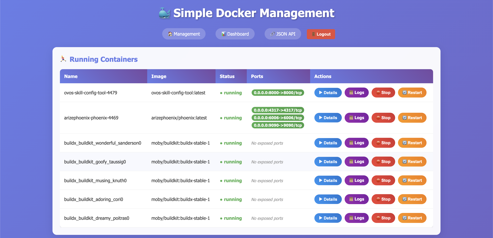

# 🐳 Simple Docker Manager



A beautiful, lightweight Docker container management service built with Rust, featuring real-time metrics visualization and an intuitive web interface.


## ✨ Features

### 🚀 Container Management

- **View Running Containers**: See all your running containers at a glance
- **Start/Stop/Restart**: Easy one-click container controls
- **Launch New Containers**: Start new containers from available images
- **Real-time Status**: Live updates of container states
- **Container Details**: Expandable details view showing environment variables and container information
- **Container Logs**: View real-time container logs with WebSocket streaming
  - **Live Log Streaming**: Real-time log updates via WebSocket connection
  - **Configurable History**: Adjustable number of log lines to display
  - **Log Export**: Download logs as text files with timestamps
  - **Auto-scroll**: Automatic scrolling to follow new log entries

### 📊 Advanced Metrics Dashboard

- **Real-time Monitoring**: Live container resource usage tracking
- **Beautiful Charts**: Interactive charts powered by Chart.js
- **System Overview**: Docker version, container counts, and image statistics
- **Resource Tracking**:
  - CPU usage percentage per container
  - Memory usage and limits
  - Network I/O (RX/TX bytes)
  - Disk I/O (read/write bytes)
  - Process counts (PIDs)

### 🎨 Modern UI

- **Responsive Design**: Works on desktop and mobile
- **Glass Morphism**: Beautiful gradient backgrounds with frosted glass effects
- **Smooth Animations**: Hover effects and transitions
- **Clean Architecture**: HTML templates separated from Rust code with shared CSS
- **Secure Authentication**: Built-in login system with session management

### 🏭 Production Ready

- **12-Factor App**: Environment-based configuration
- **Graceful Shutdown**: Proper signal handling for containers
- **Health Checks**: Built-in health and readiness endpoints
- **Structured Logging**: Configurable log levels and output
- **Zero Downtime**: Hot configuration reloads via environment

## 🛠️ Technology Stack

- **Backend**: Rust with Axum web framework
- **Docker Integration**: Bollard (Docker API client)
- **Frontend**: Vanilla JavaScript with Chart.js
- **Styling**: Modern CSS with gradients and animations
- **File Serving**: Static assets served efficiently
- **Configuration**: Environment variables with .env support

## 🔒 Security

**⚠️ IMPORTANT**: This tool provides web-based control over Docker containers. Please review our security considerations before deployment.

### Security Features

- **🔐 Mandatory Authentication**: Secure login with Argon2 password hashing
- **🛡️ Non-root Container**: Runs as unprivileged user (UID 10001)
- **📦 Minimal Attack Surface**: Built on `scratch` base image with no shell
- **🔒 Read-only Docker Socket**: Docker socket mounted read-only by default
- **🚫 Static Binary**: No runtime dependencies or package managers

### Security Scanning

- **Automated Vulnerability Scanning**: Trivy, Cargo Audit, and Semgrep
- **License Compliance**: Cargo Deny for dependency license checking
- **Secret Detection**: GitLeaks for credential scanning
- **Dockerfile Security**: Hadolint for container best practices

### Security Best Practices

- Always use HTTPS in production (reverse proxy recommended)
- Use strong passwords and short session timeouts
- Deploy in isolated networks with proper firewall rules
- Regularly update dependencies and container images
- Monitor access logs and authentication failures

📋 **See [SECURITY.md](SECURITY.md) for complete security documentation and vulnerability reporting.**

## 🛠️ Local Development & Security

### Security Checks with Just

We provide a `justfile` for running security checks locally before committing:

```bash
# Install just command runner (if not already installed)
# macOS: brew install just
# Linux: cargo install just
# Windows: cargo install just

# Run all security checks (matches CI)
just

# Quick security check (Rust only)
just security-quick

# Individual checks
just rust-security      # Cargo audit + deny
just container-security  # Docker security tests
just secret-scan        # GitLeaks (if installed)
just policy-check       # Security policy validation

# Install required security tools
just install-tools

# Show available commands
just --list
```

**Available Commands:**

- `just` or `just security-all` - Run all security checks
- `just security-quick` - Essential checks only (Rust + policy)
- `just container-basic` - Basic container security (no external tools)
- `just rust-security` - Dependency vulnerabilities and license checks
- `just versions` - Show installed security tool versions
- `just clean` - Clean up test artifacts
- `just report` - Generate security report

**Prerequisites:**

- [Just](https://github.com/casey/just) command runner
- Docker (for container security checks)
- Optional: GitLeaks, Semgrep for additional scans

## 🚀 Quick Start

### Option 1: Using Pre-built Docker Images (Recommended)

The easiest way to get started is using our pre-built Docker images from GitHub Container Registry:

```bash
# Pull the latest image
docker pull ghcr.io/oscillatelabsllc/simple-docker-manager:latest

# Run the container
docker run -d \
  --name simple-docker-manager \
  -p 3000:3000 \
  -v /var/run/docker.sock:/var/run/docker.sock:ro \
  -e SDM_PASSWORD=your-secure-password \
  --restart unless-stopped \
  ghcr.io/oscillatelabsllc/simple-docker-manager:latest

# Access the application
open http://localhost:3000
```

**Using Docker Compose:**

```yaml
version: "3.8"
services:
  simple-docker-manager:
    image: ghcr.io/oscillatelabsllc/simple-docker-manager:latest
    ports:
      - "3000:3000"
    volumes:
      - /var/run/docker.sock:/var/run/docker.sock:ro
      - sdm-data:/data # Persistent password storage
    environment:
      - SDM_PASSWORD=your-secure-password
    restart: unless-stopped

volumes:
  sdm-data:
```

### Option 2: Local Development & Building

For development or customization:

#### Prerequisites

- Rust (latest stable version)
- Docker installed and running
- Access to Docker daemon (usually requires being in the `docker` group on Linux)

#### Installation

1. **Clone the repository**

   ```bash
   git clone <repository-url>
   cd simple-docker-manager
   ```

2. **Configure the application (optional)**

   ```bash
   # Copy the example configuration
   cp env.example .env

   # Edit configuration as needed
   vim .env
   ```

3. **Build the project**

   ```bash
   cargo build --release
   ```

4. **Run the service**

   ```bash
   # With default configuration
   cargo run

   # Or with custom environment
   SDM_PORT=8080 SDM_LOG_LEVEL=debug cargo run
   ```

5. **Open your browser**
   Navigate to `http://localhost:3000` (or your configured port)

## 🐳 Docker Deployment

Simple Docker Manager is available as pre-built Docker images from GitHub Container Registry, making deployment quick and easy. The images are built with a minimal, statically-compiled container based on scratch for maximum security and efficiency.

### 📦 Pre-built Images (Recommended)

**Available Images:**

- `ghcr.io/oscillatelabsllc/simple-docker-manager:latest` - Latest stable release
- `ghcr.io/oscillatelabsllc/simple-docker-manager:v1.x.x` - Specific version tags

**Supported Architectures:**

- `linux/amd64` (x86_64)
- `linux/arm64` (ARM64/Apple Silicon)

#### Quick Deployment

```bash
# Pull and run the latest image
docker run -d \
  --name simple-docker-manager \
  -p 3000:3000 \
  -v /var/run/docker.sock:/var/run/docker.sock:ro \
  -e SDM_PASSWORD=your-secure-password \
  --restart unless-stopped \
  ghcr.io/oscillatelabsllc/simple-docker-manager:latest
```

### 🐙 Using Docker Compose (Recommended)

The easiest way to deploy is using Docker Compose with the pre-built image:

```bash
# Start the service
docker-compose up -d

# View logs
docker-compose logs -f

# Stop the service
docker-compose down
```

### 🏗️ Building Your Own Image (Development)

If you need to customize the image or build from source:

#### Option 1: Using the Build Script (Recommended)

```bash
# Build with default settings
./docker-build.sh

# Build and run immediately
./docker-build.sh --run

# Build with custom tag
./docker-build.sh --tag v1.0.0

# Build and push to registry
./docker-build.sh --registry ghcr.io/yourusername --push

# Build without cache
./docker-build.sh --no-cache

# See all options
./docker-build.sh --help
```

#### Option 2: Manual Docker Build

```bash
# Build the image
docker build -t simple-docker-manager:latest .

# Run the container
docker run -d \
  --name simple-docker-manager \
  -p 3000:3000 \
  -v /var/run/docker.sock:/var/run/docker.sock:ro \
  --restart unless-stopped \
  simple-docker-manager:latest
```

### 🏷️ Container Features

- **Minimal Size**: Built on `scratch` base image for maximum security and minimal attack surface
- **Static Binary**: Fully statically linked Rust binary with no runtime dependencies
- **OCI Labels**: Comprehensive metadata for better container registry UX
- **Health Endpoints**: Built-in `/health` and `/ready` endpoints for monitoring
- **Proper Shutdown**: Graceful handling of termination signals

### 🔧 Container Configuration

Configure the container using environment variables:

```bash
docker run -d \
  --name simple-docker-manager \
  -p 3000:3000 \
  -v /var/run/docker.sock:/var/run/docker.sock:ro \
  -e SDM_LOG_LEVEL=debug \
  -e SDM_METRICS_INTERVAL_SECONDS=10 \
  -e SDM_PORT=3000 \
  --restart unless-stopped \
  simple-docker-manager:latest
```

### 🌐 Production Deployment

For production environments, use the pre-built images:

### 🔍 Health Monitoring

The container exposes health endpoints for monitoring:

```bash
# Health check (includes Docker connectivity)
curl http://localhost:3000/health

# Readiness check (service is ready to handle requests)
curl http://localhost:3000/ready

# View container logs
docker logs -f simple-docker-manager
```

### 🚨 Security Considerations

- **Read-only Docker socket**: The container mounts Docker socket as read-only by default
- **Non-root execution**: The application runs as a non-root user within the container
- **Minimal attack surface**: Scratch base image contains no shell, package manager, or unnecessary utilities
- **Network isolation**: Use Docker networks to isolate the container if needed

### 📦 Image Details

- **Base Image**: `scratch` (minimal, security-focused)
- **Binary**: Statically compiled Rust binary (~10-20MB)
- **Total Size**: Typically under 30MB
- **Architecture**: Currently supports `x86_64` Linux
- **OCI Compliant**: Full OCI label support for registry metadata

## 📁 Project Structure

```
simple-docker-manager/
├── src/
│   ├── main.rs           # Application entry point with 12-Factor setup
│   ├── config.rs         # Environment-based configuration
│   ├── web.rs            # Web routes and handlers
│   ├── docker.rs         # Docker API integration
│   └── models.rs         # Data structures
├── templates/
│   ├── dashboard.html    # Metrics dashboard template
│   └── management.html   # Container management template
├── static/
│   ├── styles.css        # Shared CSS styles
│   └── dashboard.js      # Frontend JavaScript
├── Dockerfile            # Multi-stage Docker build
├── docker-compose.yml    # Compose configuration
├── docker-build.sh       # Build script with options
├── .dockerignore        # Docker build context exclusions
├── env.example          # Configuration template
├── Cargo.toml           # Rust dependencies
└── README.md           # This file
```

## 🌐 API Endpoints

### Web Interface

- `GET /` - Main container management interface
- `GET /metrics` - Real-time metrics dashboard

### Health & Monitoring

- `GET /health` - Health check endpoint (returns 200/503 with Docker status)
- `GET /ready` - Readiness probe endpoint (always returns 200 when server is up)

### Container Management

- `POST /start-image` - Start a new container from an image
- `POST /start/:id` - Start a stopped container
- `POST /stop/:id` - Stop a running container
- `POST /restart/:id` - Restart a container

### Container Logs

- `GET /logs/:id` - View container logs with optional `?tail=N` parameter
- `GET /logs/:id/ws` - WebSocket endpoint for real-time log streaming

### API Endpoints

- `GET /api/metrics` - JSON metrics data for all containers
- `GET /api/config` - Current configuration settings

### Authentication

- `GET /login` - Login page (when authentication is enabled)
- `POST /login` - Submit login credentials
- `POST /logout` - Logout and clear session

### Static Assets

- `/static/*` - CSS, JavaScript, and other static files

## ⚙️ Configuration

The application follows the [12-Factor App](https://12factor.net/) methodology and is configured entirely through environment variables.

### Environment Variables

All configuration is done via environment variables prefixed with `SDM_`:

| Variable                       | Default        | Description                                           |
| ------------------------------ | -------------- | ----------------------------------------------------- |
| `SDM_HOST`                     | `0.0.0.0`      | Server bind address                                   |
| `SDM_PORT`                     | `3000`         | Server port                                           |
| `SDM_LOG_LEVEL`                | `info`         | Log level (`error`, `warn`, `info`, `debug`, `trace`) |
| `SDM_DOCKER_SOCKET`            | auto-detected  | Docker socket path                                    |
| `SDM_METRICS_INTERVAL_SECONDS` | `5`            | Metrics update interval                               |
| `SDM_METRICS_HISTORY_LIMIT`    | `20`           | Max metrics history points                            |
| `SDM_MAX_CHART_CONTAINERS`     | `5`            | Max containers shown in charts (for performance)      |
| `SDM_SHUTDOWN_TIMEOUT_SECONDS` | `30`           | Graceful shutdown timeout                             |
| `SDM_AUTH_ENABLED`             | `true`         | Enable/disable authentication                         |
| `SDM_AUTH_USERNAME`            | `admin`        | Username for authentication                           |
| `SDM_AUTH_PASSWORD`            | auto-generated | Password for authentication (see below)               |
| `SDM_SESSION_TIMEOUT_SECONDS`  | `3600`         | Session timeout (1 hour)                              |
| `SDM_PASSWORD_FILE`            | auto-detected  | Custom password file location                         |

### 🔐 Authentication & Password Management

The Simple Docker Manager uses secure authentication by default to protect your Docker environment.

#### Password Behavior

1. **Custom Password**: Set `SDM_AUTH_PASSWORD` environment variable

   ```bash
   SDM_AUTH_PASSWORD=your_secure_password cargo run
   ```

2. **Auto-Generated Password**: If no password is provided, the system will:

   - Generate a secure 24-character random password
   - Save it to a persistent file with secure permissions (600)
   - Display the password in logs on first run
   - Reuse the saved password on subsequent runs

3. **Password File Locations**: The system automatically chooses the best location:

   **For Containers** (auto-detected):

   - `/data/sdm_password` (preferred - mount a volume here)
   - `/config/sdm_password` (alternative config location)
   - `/app/data/sdm_password` (app-specific data directory)
   - `/var/lib/sdm/password` (system-style location)

   **For Development**:

   - `.sdm_password` (current directory)

   **Custom Location**:

   ```bash
   SDM_PASSWORD_FILE=/my/custom/path/password cargo run
   ```

4. **Accessing Your Password**:

   ```bash
   # View the current password (path shown in startup logs)
   cat /data/sdm_password

   # Or check the logs when starting the application
   cargo run
   ```

#### Container Deployment with Persistent Password

**Docker Run**:

```bash
# Create a volume for persistent password storage
docker volume create sdm-data

# Run with volume mounted
docker run -d \
  --name simple-docker-manager \
  -p 3000:3000 \
  -v /var/run/docker.sock:/var/run/docker.sock:ro \
  -v sdm-data:/data \
  --restart unless-stopped \
  ghcr.io/oscillatelabsllc/simple-docker-manager:latest

# View the generated password
docker exec simple-docker-manager cat /data/sdm_password
```

**Docker Compose**:

```yaml
services:
  simple-docker-manager:
    image: ghcr.io/oscillatelabsllc/simple-docker-manager:latest
    ports:
      - "3000:3000"
    volumes:
      - /var/run/docker.sock:/var/run/docker.sock:ro
      - sdm-data:/data # Persistent password storage
    restart: unless-stopped

volumes:
  sdm-data:
```

#### Security Features

- **Argon2 Hashing**: Passwords are hashed using industry-standard Argon2
- **Secure File Permissions**: Password file is created with 600 permissions (owner read/write only)
- **Session Management**: Configurable session timeouts with secure cookies
- **Container Detection**: Automatically uses container-friendly paths when deployed
- **HTTPS Ready**: Use behind a reverse proxy with TLS for production

#### Disabling Authentication (Not Recommended)

```bash
# Only for development/testing - NOT for production
SDM_AUTH_ENABLED=false cargo run
```

⚠️ **Security Warning**: Disabling authentication gives unrestricted access to Docker containers!

### Configuration Methods

#### 1. Environment Variables (Recommended for Production)

```bash
export SDM_PORT=8080
export SDM_LOG_LEVEL=warn
cargo run --release
```

#### 2. .env File (Recommended for Development)

```bash
# Copy the example
cp env.example .env

# Edit your configuration
echo "SDM_PORT=8080" >> .env
echo "SDM_LOG_LEVEL=debug" >> .env

# Run (automatically loads .env)
cargo run
```

#### 3. Runtime Override

```bash
# Override specific values at runtime
SDM_PORT=9000 SDM_LOG_LEVEL=trace cargo run
```

### Container Deployment

For Docker deployment, pass environment variables:

```bash
docker run -e SDM_PORT=8080 -e SDM_LOG_LEVEL=warn ghcr.io/oscillatelabsllc/simple-docker-manager:latest
```

## 📊 Metrics Data Structure

The `/api/metrics` endpoint returns comprehensive container metrics:

```json
{
  "system": {
    "timestamp": "2024-01-01T12:00:00Z",
    "total_containers": 5,
    "running_containers": 3,
    "total_images": 10,
    "docker_version": "24.0.0"
  },
  "containers": [
    {
      "container_id": "abc123...",
      "container_name": "my-app",
      "timestamp": "2024-01-01T12:00:00Z",
      "cpu_usage_percent": 15.5,
      "memory_usage_mb": 256.0,
      "memory_limit_mb": 512.0,
      "memory_usage_percent": 50.0,
      "network_rx_bytes": 1024000,
      "network_tx_bytes": 512000,
      "block_read_bytes": 204800,
      "block_write_bytes": 102400,
      "pids": 25
    }
  ]
}
```

## 🎯 Key Features Explained

### Real-time Metrics Collection

The service continuously polls Docker for container statistics, calculating:

- **CPU Usage**: Percentage based on system CPU time
- **Memory Usage**: Current usage vs. container limits
- **Network Traffic**: Bytes received and transmitted
- **Disk I/O**: Read and write operations
- **Process Count**: Number of running processes

### Responsive Charts

- **Live Updates**: Charts update every 5 seconds (configurable)
- **History Tracking**: Maintains configurable data points for trend visualization
- **Multiple Metrics**: Separate charts for CPU, memory, network, and disk
- **Color Coding**: Unique colors per container for easy identification

### Clean Architecture

- **Separation of Concerns**: HTML templates separate from Rust code
- **Shared Styling**: Single CSS file for consistent design across views
- **Static Asset Serving**: Efficient file serving for CSS/JS
- **Type Safety**: Strong typing with Rust's type system
- **Error Handling**: Graceful error handling and user feedback

### Container Details & Management

- **Expandable Details**: Click the "Details" button to view comprehensive container information
- **Environment Variables**: Sorted alphabetically for easy browsing
- **Port Mappings**: Consistently ordered by container port number for predictable display
- **Container Information**: Full container ID, image details, and metadata
- **One-Click Actions**: Start, stop, restart, and view logs directly from the interface

## 🔧 Operations

### Health Monitoring

The application provides standard health check endpoints:

- **Health Check** (`/health`): Returns 200 if Docker is accessible, 503 otherwise
- **Readiness Check** (`/ready`): Returns 200 if the server can handle requests

### Graceful Shutdown

The application handles shutdown signals gracefully:

- **SIGTERM**: Container termination
- **SIGINT**: Ctrl+C for development
- **Configurable timeout**: Prevents hanging shutdowns

### Logging

Structured logging with configurable levels:

```bash
# Development
SDM_LOG_LEVEL=debug cargo run

# Production
SDM_LOG_LEVEL=warn cargo run

# Environment-based (respects RUST_LOG if SDM_LOG_LEVEL not set)
RUST_LOG=simple_docker_manager=debug cargo run
```

## 🐛 Troubleshooting

### Common Issues

#### Application Won't Start

1. **Port in use**: Change the port via environment variable

   ```bash
   SDM_PORT=8080 cargo run
   ```

2. **Permission denied**: Ensure Docker access

   ```bash
   # Add user to docker group (Linux)
   sudo usermod -aG docker $USER
   # Log out and back in
   ```

3. **Docker not accessible**: Check Docker daemon
   ```bash
   docker ps  # Should work without sudo
   ```

#### Configuration Issues

1. **Check current configuration**: The app logs its configuration on startup
2. **Validate environment variables**: Ensure proper naming (`SDM_` prefix)
3. **Check .env file**: Ensure it's in the working directory

#### Performance Issues

1. **Adjust metrics interval**:

   ```bash
   SDM_METRICS_INTERVAL_SECONDS=10 cargo run
   ```

2. **Reduce history retention**:
   ```bash
   SDM_METRICS_HISTORY_LIMIT=10 cargo run
   ```

#### Container Access Issues

- **Docker socket**: The app auto-detects Docker socket location
- **Custom socket**: Set `SDM_DOCKER_SOCKET=/path/to/docker.sock`
- **Remote Docker**: Currently not supported (local socket only)

#### Docker Socket Permission Issues

If you see errors like `Error in the hyper legacy client: client error (Connect)`, this indicates Docker socket permission problems:

**Symptoms:**

- Authentication works fine, but API endpoints fail
- Error message: "hyper legacy client: client error (Connect)"
- Health endpoint returns unhealthy status

**Root Cause:**
The container runs as a non-root user (UID 10001) by default, but Docker socket access typically requires root privileges or docker group membership.

**Solutions:**

1. **Run as root (Docker Compose - Recommended for simplicity):**

   ```yaml
   services:
     simple-docker-manager:
       # ... other config ...
       user: "0:0" # Run as root
   ```

2. **Use host user (Linux only):**

   ```yaml
   services:
     simple-docker-manager:
       # ... other config ...
       user: "${DOCKER_USER_ID:-1000}:${DOCKER_GROUP_ID:-1000}"
   ```

   ```bash
   export DOCKER_USER_ID=$(id -u)
   export DOCKER_GROUP_ID=$(getent group docker | cut -d: -f3)
   docker-compose up -d
   ```

3. **Docker run with root:**
   ```bash
   docker run -d \
     --name simple-docker-manager \
     --user 0:0 \
     -p 3000:3000 \
     -v /var/run/docker.sock:/var/run/docker.sock:ro \
     ghcr.io/oscillatelabsllc/simple-docker-manager:latest
   ```

**Note:** On macOS with Docker Desktop, running as root is typically required since there's no docker group. On Linux, you can alternatively add the container user to the docker group.
